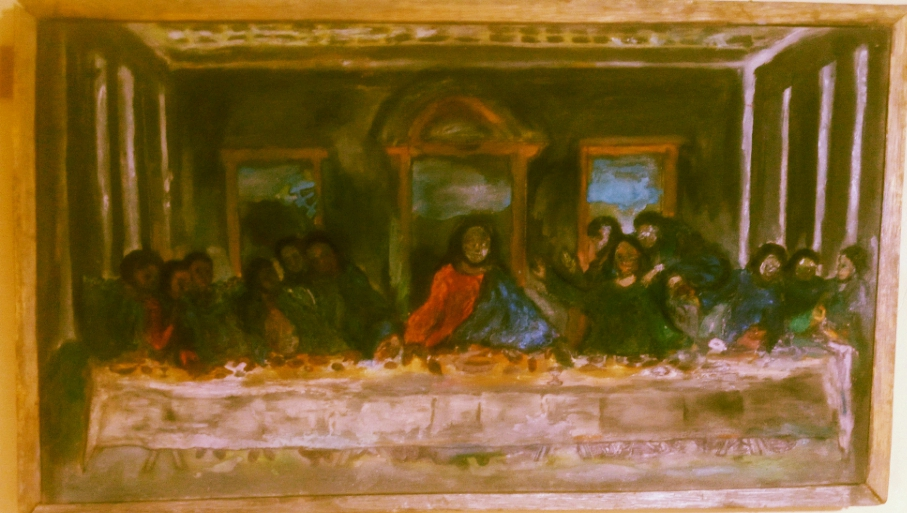

# Awe-Some-Da-Vinci

## State of Neuer Rennaissance

  

### A Philosophical and Artistic Exploration of Italian Renaissance polymath and painter’s entity artwork, "The Last Supper", "Mural by Leonardo da Vinci".

---

# Introduction

This project, *Awe-Some-Da-Vinci: State of Neuer Renaissance*, is an exploration of consciousness, symbolism, divinity, humanity, authorship, memory, and time through the lens of *The Last Supper*. Rather than treating the painting merely as a historical artwork, this project approaches it as a neurological, philosophical, spiritual, and temporal construct.

The investigation is built around five major points:

1. The Painter — questioning the hand and intention of Leonardo.
2. The Muse — questioning Jesus, the disciples, and their arrangement.
3. The Subject — questioning God, humanity, and the audience of existence.
4. Originality — questioning whether originality exists if an image existed first in language, story, or thought.
5. History Against the Passing of Time — questioning whether *The Last Supper* remains the “last” supper when time continuously reconstructs meaning.

The work exists between art criticism, theology, metaphysics, historical analysis, and neu-reconnaissance — the reconstruction of meaning through layered perception.

---

# The Painter

## Questioning the Hand of Leonardo

### Who was Leonardo painting for?

"Leonardo da Vinci","Italian Renaissance polymath and painter"] was not simply documenting a biblical scene. He was constructing a psychological theatre.

Unlike earlier religious painters who emphasized holiness through static symbolism, Leonardo transformed the moment into an emotional explosion. The painting captures the exact moment when Jesus says:

> “One of you will betray me.”

The result is not a frozen religious icon. It becomes a living neurological event.

Every disciple reacts differently:

* shock,
* fear,
* denial,
* suspicion,
* anger,
* confusion,
* introspection.

Leonardo paints thought itself.

### Intention of the Painter

The intention may not have been simply religious devotion. Instead, Leonardo appears to investigate:

* human psychology,
* tension between divinity and mortality,
* order and chaos,
* silence and reaction,
* the architecture of emotional consciousness.

The hand of Leonardo becomes both scientific and spiritual.

He studies:

* anatomy,
* perspective,
* geometry,
* optics,
* emotional expression.

Thus the painting becomes:

* a scientific map of emotion,
* a theological diagram,
* a philosophical machine.

### The Hand as an Extension of Thought

The “hand of Leonardo” can also be interpreted metaphorically.

Was Leonardo truly the creator?
Or was he translating:

* scripture,
* collective belief,
* inherited myth,
* divine imagination,
* historical memory?

In this interpretation, the painter becomes less of an inventor and more of a receiver.

The brush becomes a neurological instrument through which civilization remembers itself.

---

# The Muse

## Jesus and the Arrangement of the Disciples

### Why this exact moment?

"Jesus Christ","Central figure of Christianity" is positioned at the center of the composition.

The entire geometry of the room converges toward him.

This centrality creates several meanings simultaneously:

* spiritual gravity,
* visual balance,
* theological authority,
* emotional stillness.

Jesus becomes the calm axis inside collective human turbulence.

### The Disciples as Emotional States

The disciples are arranged in groups of three.

This grouping may symbolize:

* the Trinity,
* balance and instability,
* cycles of reaction,
* collective psychology.

Each disciple behaves differently.

The arrangement transforms the disciples from historical individuals into representations of humanity itself.

Possible symbolic interpretations include:

| Disciple Reaction | Human Condition   |
| ----------------- | ----------------- |
| Fear              | mortality         |
| Denial            | self-preservation |
| Anger             | ego               |
| Doubt             | uncertainty       |
| Silence           | contemplation     |
| Betrayal          | human weakness    |

Thus, the disciples stop being only followers of Christ.

They become mirrors of humanity.

### Why At That Particular Time?

Leonardo chooses the moment before collapse.

Not the crucifixion.
Not the resurrection.
Not the miracle.

But the psychological fracture before destiny unfolds.

This moment matters because it is universally human:

* the moment before truth arrives,
* the second before trust breaks,
* the silence before history changes.

The painting, therefore, becomes timeless.

---

# The Subject

## God, Humanity, and the Audience

### Jesus as Representation of the Divine

Within the composition, Jesus may represent:

* divine consciousness,
* perfect stillness,
* sacrificial awareness,
* cosmic order.

His triangular posture suggests stability.

The triangle itself can symbolize:

* heaven,
* divinity,
* eternity,
* the Trinity.

The disciples, by contrast, are unstable and fragmented.

This creates tension between:

* divine permanence,
* human impermanence.

### The Disciples as Humanity

The disciples can be interpreted as humanity reacting to truth.

Each figure becomes a neurological response.

Together they represent:

* confusion,
* loyalty,
* fear,
* ambition,
* love,
* betrayal,
* faith.

The table itself separates and unites them.

It becomes:

* a physical barrier,
* a spiritual bridge,
* a symbolic world.

### The Audience as the Rest of the World

The viewer occupies the missing side of the table.

This is important.

The audience is not outside the painting.
The audience completes the painting.

The viewer becomes:

* witness,
* judge,
* participant,
* future historian.

In this sense, the world itself becomes the continuation of *The Last Supper*.

The event never ends.

Humanity continues reenacting:

* betrayal,
* devotion,
* fear,
* sacrifice,
* spiritual searching.

---

# Originality

## Can the First Original Truly Be Original?

### Was the Painting Original?

The entity ["artwork","The Last Supper","Mural by Leonardo da Vinci"] was painted by Leonardo.

But the story existed before the painting.

The biblical narrative already existed through:

* oral tradition,
* scripture,
* collective memory,
* theology.

This raises a philosophical question:

Can an artwork be original if its subject already existed in language?

### The Bible as the First Canvas

Before paint, there was word.

The story existed in:

* speech,
* memory,
* scripture.

Therefore, the painting may not be the first “Last Supper.”

The first Last Supper may have existed:

* in conversation,
* in witness testimony,
* in spiritual imagination,
* in collective consciousness.

Leonardo’s version becomes the first true translation rather than the original.

### Originality as Reconstruction

Originality may not mean creating something from nothing.

Instead, originality may mean:

* reinterpreting meaning,
* reconstructing perception,
* giving old ideas new neurological life.

Thus, Leonardo’s originality lies not in inventing the story but in redesigning how humanity experiences it.

---

# History Against the Passing of Time

## Is It Truly the Last Supper?

### The Problem of “Last.”

The title itself contains a paradox.

If humanity continuously remembers, studies, reproduces, restores, debates, and reimagines the supper, then was it ever truly “last”?

The event survives through:

* paintings,
* literature,
* ritual,
* memory,
* religion,
* digital reconstruction.

Therefore, the supper continues across time.

It becomes eternally repeated.

### Time Changes Meaning

The meaning of *The Last Supper* changes depending on historical context.

A Renaissance viewer saw:

* religious authority,
* divine symbolism,
* sacred narrative.

A modern viewer may see:

* psychology,
* politics,
* artistic innovation,
* human conflict,
* symbolic systems.

Future civilizations may interpret it differently again.

Time, therefore, repaints the artwork continuously.

---

# Adam, Eve, and the Question of First Creation

The project also investigates creation itself.

Through the story of entity["fictional_character", "Adam", "Biblical first man"] and entity["fictional_character", "Eve", "Biblical first woman"], another temporal question emerges:

If creation stories are retold across generations, then where does the “original” truly exist?

Possible answers include:

* in divine thought,
* in spoken word,
* in written scripture,
* in artistic representation,
* in collective memory.

Similarly, *The Last Supper* evolves through time.

The painting we see today is not the same as the one Leonardo painted.

It has been:

* damaged,
* restored,
* reproduced,
* digitized,
* reinterpreted.

Time itself becomes a co-artist.

---

# Neuer Rennaissance

## The Central Concept

“Neuer Renaissance” within this project can be understood as:

> the exploration and reconstruction of meaning through layered consciousness, memory, symbolism, history, and perception.

The project examines how:

* the brain recognizes symbols,
* humanity reconstructs narratives,
* time modifies truth,
* Art becomes neurological memory.

Thus *The Last Supper* becomes:

* not just a painting,
* but a living cognitive structure.

---

# Conclusion

*Awe-Some-Da-Vinci: State of Neuer Renaissance* transforms entity ["artwork", "The Last Supper", "Mural by Leonardo da Vinci"] from a religious mural into a multidimensional investigation.

The project questions:

* authorship,
* divinity,
* humanity,
* originality,
* historical permanence,
* the instability of meaning across time.

At its deepest level, the work argues that art is never static.

Every generation repaints meaning psychologically, culturally, spiritually, and historically.

Therefore, *The Last Supper* is not merely a past event.

It is an ongoing human condition.

## Awe-Some-Da-Vinci — For You

This project explores :contentReference[oaicite:0]{index=0} as a **multi-layer cognitive operating system**, spanning art, cognition, theology, systems engineering, and computational philosophy.

It is not a reinterpretation of a painting.

It is a structured attempt to model meaning, perception, and consciousness as executable systems.

We invite researchers, artists, engineers, and thinkers to explore and contribute across the following domains.

---

# 1. /for-programmers

**Link:**  
https://github.com/CodeDroid999/awesome-da-vinci/tree/main/explorations/for-programmers

### Who it is for:
- Software engineers  
- Systems architects  
- AI/ML researchers  
- Distributed systems engineers  
- Computational modelers  

### What you will find:
A full **cognitive operating system model** of The Last Supper:
- communication protocols as meaning exchange  
- identity as probabilistic state machine  
- time as asynchronous processing  
- trust as a security architecture  
- multi-agent inference systems  

### Why you should explore it:
If you think in systems, code, or architectures—this section reframes art as a **computable cognitive environment**.

It asks:

> What if a painting behaves like a distributed system?

---

# 2. /for-philosophers

**Link:**  
https://github.com/CodeDroid999/awesome-da-vinci/tree/main/explorations/for-philosophers

### Who it is for:
- Philosophers of mind  
- Metaphysicians  
- Epistemologists  
- Phenomenologists  
- Semiotic theorists  

### What you will find:
- meaning construction  
- truth under uncertainty  
- perception as interpretation layer  
- consciousness as distributed cognition  

### Why you should explore it:
It asks:

> Is meaning discovered—or continuously computed by consciousness itself?

---

# 3. /for-artists

**Link:**  
https://github.com/CodeDroid999/awesome-da-vinci/tree/main/explorations/for-artists

### Who it is for:
- Visual artists  
- Conceptual artists  
- Digital creators  
- Art historians  
- Curators  

### What you will find:
- composition as cognition  
- symbolic emotional architecture  
- visual tension as thought structure  
- art as living system rather than object  

### Why you should explore it:
It reframes painting as:

> a thinking field made visible

---

# 4. /for-theologians

**Link:**  
https://github.com/CodeDroid999/awesome-da-vinci/tree/main/explorations/for-theologians

### Who it is for:
- Theologians  
- Biblical scholars  
- Religious historians  
- Symbolic interpreters of scripture  

### What you will find:
- divine centrality as cognitive structure  
- disciples as archetypal human states  
- sacred narrative as recursive symbolic system  

### Why you should explore it:
It asks:

> Is sacred narrative static revelation—or a living symbolic computation?

---

# 5. /for-psychologists

**Link:**  
https://github.com/CodeDroid999/awesome-da-vinci/tree/main/explorations/for-psychologists

### Who it is for:
- Cognitive psychologists  
- Neuroaesthetics researchers  
- Perception scientists  
- Emotion modeling researchers  

### What you will find:
- emotion as distributed field  
- group cognition under tension  
- betrayal as identity instability trigger  
- perception under uncertainty  

### Why you should explore it:
It models human cognition as:

> a shared system under sudden semantic shock

---

# 6. /for-historians

**Link:**  
https://github.com/CodeDroid999/awesome-da-vinci/tree/main/explorations/for-historians

### Who it is for:
- Renaissance historians  
- Intellectual historians  
- Cultural historians  
- Archive researchers  

### What you will find:
- history as layered reconstruction  
- meaning drift across centuries  
- restoration as reinterpretation  

### Why you should explore it:
It proposes:

> history is not preserved—it is continuously recomputed

---

# 7. /for-engineers

**Link:**  
https://github.com/CodeDroid999/awesome-da-vinci/tree/main/explorations/for-engineers

### Who it is for:
- Systems engineers  
- Infrastructure designers  
- Complexity engineers  

### What you will find:
- stability vs collapse architectures  
- structural models of symbolic systems  
- resilience in meaning networks  

### Why you should explore it:
It asks:

> Can meaning systems be engineered like resilient infrastructures?

---

# 8. /for-ai-researchers

**Link:**  
https://github.com/CodeDroid999/awesome-da-vinci/tree/main/explorations/for-ai-researchers

### Who it is for:
- AI researchers  
- LLM scientists  
- Multi-agent system designers  
- Knowledge representation researchers  

### What you will find:
- cognition as multi-agent inference  
- attention routing analogies  
- symbolic reasoning under uncertainty  

### Why you should explore it:
It reframes cognition as:

> a distributed intelligence system reacting to epistemic rupture

---

# 9. /for-readers

**Link:**  
https://github.com/CodeDroid999/awesome-da-vinci/tree/main/explorations/for-readers

### Who it is for:
- General audiences  
- Students  
- Creative thinkers  

### What you will find:
- accessible narrative entry points  
- guided conceptual explanations  

### Why you should explore it:
It translates complexity into:

> human-readable pathways into structured meaning

---

# 10. /for-meta

**Link:**  
https://github.com/CodeDroid999/awesome-da-vinci/tree/main/explorations/for-meta

### Who it is for:
- Systems theorists  
- Meta-researchers  
- Philosophers of computation  

### What you will find:
- self-referential systems  
- recursion in meaning formation  
- observer effects on interpretation  

### Why you should explore it:
It asks:

> What happens when a system studies itself as meaning?

---

# WHY YOU SHOULD CONTRIBUTE — NEUER RENAISSANCE MANIFESTO

This project is not complete.

It is deliberately **incomplete by design**.

It exists as a growing structure of interpretation that expands with every contributor.

We are forming a new intellectual movement:

# The Neuer Renaissance

A framework where:
- art becomes computation  
- philosophy becomes system design  
- theology becomes symbolic architecture  
- programming becomes cognitive modeling  
- history becomes recursive reconstruction  

---

## What makes your contribution important

When you contribute, you are not adding content.

You are expanding a **living cognitive system**.

Every contribution becomes:

- a new cognitive layer  
- a new interpretive engine  
- a new node in a distributed meaning network  

---

## What we are building together

We are building:

- a multi-disciplinary cognitive operating system  
- a symbolic simulation of human consciousness  
- a structured map of meaning under uncertainty  
- a shared architecture of interpretation  

---

## Why this matters

Modern knowledge is fragmented:

- science is separated from art  
- computation is separated from philosophy  
- theology is separated from cognition  

The Neuer Renaissance aims to reconnect them into a single structured field.

Not by simplifying them—

but by **interconnecting them structurally**.

---

## Final Invitation

If you are:

- a thinker  
- a builder  
- a researcher  
- a creator  
- or a system designer of meaning  

Then you are not outside this project.

You are already part of its unfinished structure.

---

## Join the movement

Contribute, extend, fork, or reinterpret.

But most importantly:

> Treat meaning itself as something that can be engineered, explored, and expanded.

---

The Neuer Renaissance is not a concept.

It is an emerging collaborative system of thought.

And it has only just begun.
